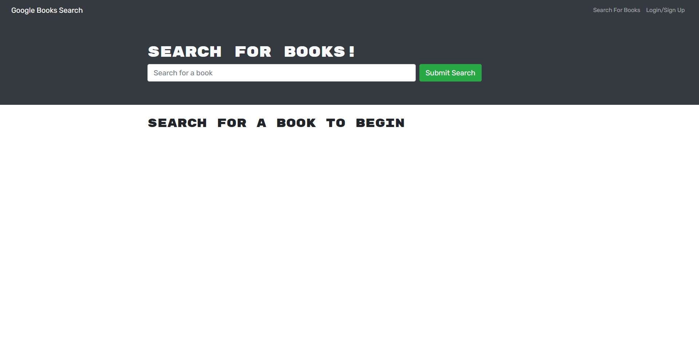
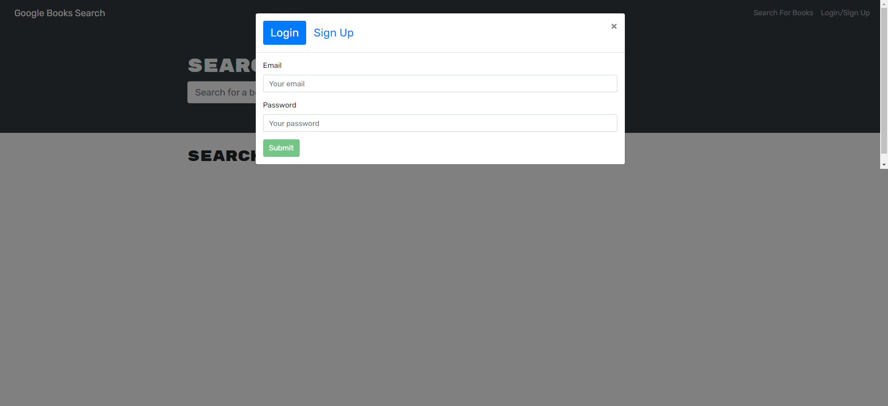
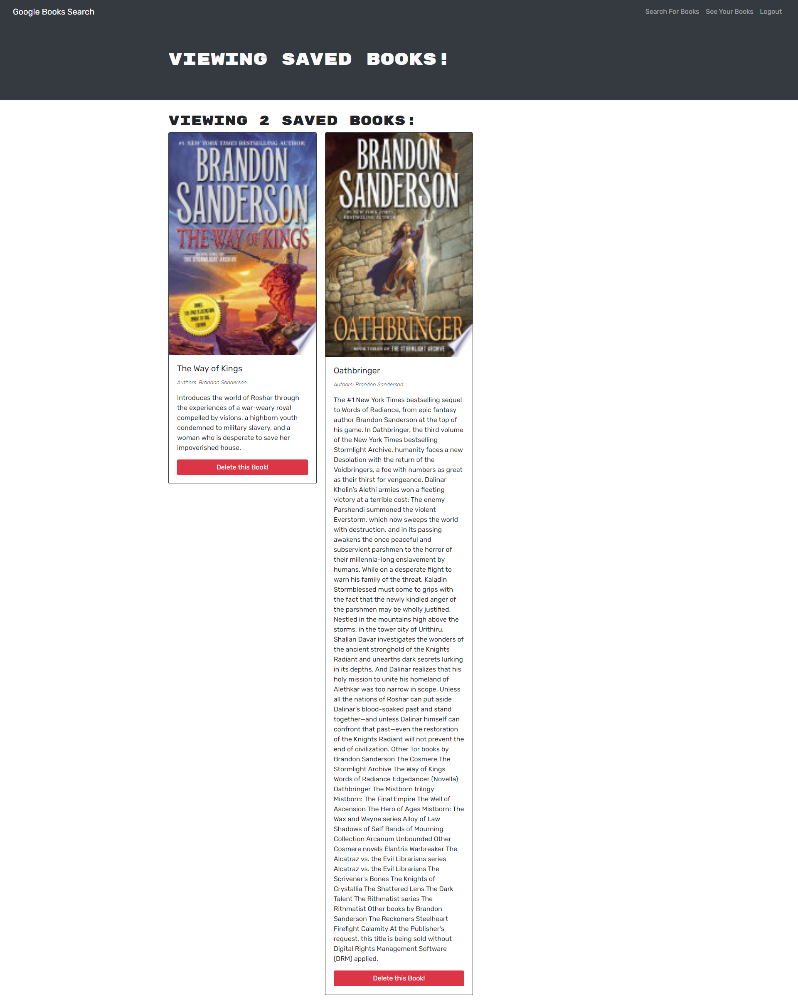

# Book Search Engine

    
## Description
Book Search Engine allows users to create a profile to search and save books for personal reference.

## Table of Contents
* [License Information](#license-information)
* [Tools](#tools)
* [Links](#links)
* [Screen Shots](#screen-shots)
* [Contact](#questions)

## License Information
Licensed under the [MIT_License](LICENSE)

## Tools
- MongoDB
- Express
- React
- Node
    

## Links
- GitHub: https://github.com/corycalaway/book_search_engine
- Heroku: https://secure-woodland-07865.herokuapp.com/

## Screen Shots

### Questions
- For further questions please reach out through the following:
    - Email: cory.c.calaway@gmail.com
    - GitHub: https://github.com/corycalaway/Book Search Engine